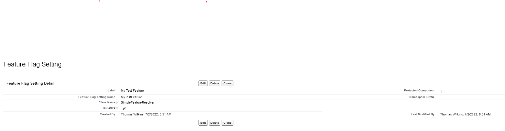
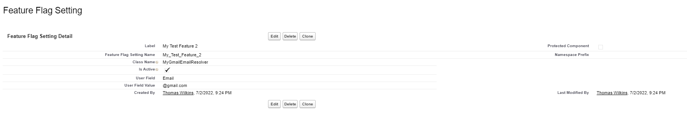

# Using Simple Feature Flags

## References

- [FeatureFlag Class](../../apex/Env/FeatureFlag.md)
- [FeatureResolver Abstract Class](../../apex/Env/FeatureResolver.md)
- [SimpleFeatureResolver Class](../../apex/Env/SimpleFeatureResolver.md)
- [Feature Flags](https://martinfowler.com/articles/feature-toggles.html)

### Configuring a Simple Feature Flag

One of the simplest forms of feature flag is a global on/off switch. When the configuration is flagged as active, the feature will be on. When it is not, the feature will be off.
To configure a simple feature, navigate to Setup -> Custom Metadata Types -> Feature Flag Settings -> Manage Feature Flag Settings -> New and fill out the metadata information.
The label is just a descriptor, and can be any value. The DeveloperName is the feature flag key -- this is what will be referenced in code. The Class Name should be set to SimpleFeatureResolver
and the feature should be marked as active or inactive.



### Referencing a Feature Flag in Apex

```java
// referencing a feature flag is simple
// using a factory or dependency injecting based
// on feature flags can be quite powerful flexible
if (Libs.Environment.feature.isOn('MyTestFeature')) {
    System.debug('Feature on!');
} else {
    System.debug('Feature off...');
}
```

### Creating a Custom Feature Flag Resolver

One of the characteristics of this framework is the ability to create your own feature flag resolvers outside of the ones shipped with this package. To do that there are
a few things that need to happen.

First, determine what data elements and configuration attributes will be needed for the feature flag. For example, let's say you want to enable a feature based on a
specific field on User. You can extend the FeatureFlagSetting**mdt to include a UserField**c field and a UserFieldValue\_\_c field:



In this case, we are configuring the field to be Email (which we effectively ignore, but helps for clarity), and the value we are looking for to be @gmail.com (the custom resolver will look for this to determine access). The ClassName\_\_c field
maps to the following custom class:

```java
// note the class and methods are global -- this is necessary to work within the package
global inherited sharing class MyGmailEmailResolver extends Libs.FeatureFlagResolver {
    global override Boolean resolve() {
        // simple non-regex example for the purposes of this demo
        // you can access mdt record via getConfig -- which returns all fields on the metadata object
        return this.getConfig().Libs__IsActive__c && UserInfo.getUserEmail().contains(this.getConfig().UserFieldValue__c);
    }
}
```
