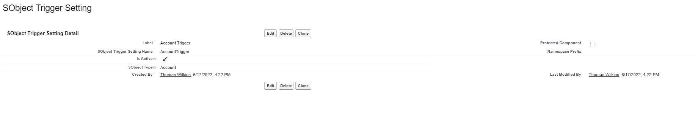
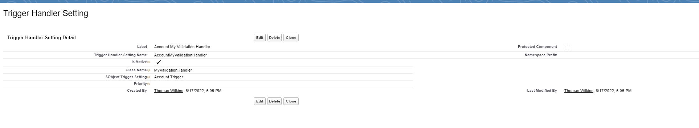

# Creating Triggers and Trigger handlers

## References

- [TriggerDispatcherFactory](../apex/Triggers/TriggerDispatcherFactory.md)
- [TriggerContext](../apex/Triggers/TriggerContext.md)
- [TriggerDispatcher](../apex/Triggers/TriggerDispatcher.md)
- [TriggerHandler](../apex/Triggers/TriggerHandler.md)
- [Salesforce Trigger Documentation](https://developer.salesforce.com/docs/atlas.en-us.apexcode.meta/apexcode/apex_triggers.htm)

## Defining a Trigger for an SObject

There are 2 steps to defining a trigger to use this framework. The first is to create a Trigger (if one is not already present) and create and dispatch trigger logic for the SObject bound to the trigger:

```java
trigger AccountTrigger on Account (
    before insert,
    before update,
    before delete,
    after insert,
    after update,
    after delete,
    after undelete
) {
	Libs.Triggers.factory.create(Account.getSObjectType()).dispatch();
}
```

In the above trigger, you'll notice that all trigger contexts are defined. There are minor performance implications of doing this, however it has the significant maintenance and extension benefit of only requiring modification of the trigger when the trigger is first created, reducing risk of bugs where the trigger isn't modified to account for a new trigger context.

Once the trigger is in place, a trigger configuration must then be defined. Navigate to Setup -> Custom Metadata Types -> SObject Trigger Settings -> Manage SObject Trigger Settings -> New and fill out the metadata information. Label and SObject Trigger Setting Name have no impact on functionality, so name whatever makes sense. Flag it as active or inactve depending on how your team managed triggers (note this also gives a production shutoff switch for triggers). For SObjectType, enter a string representation of the SObject Type to execute the trigger for. Note that this must also consider the namespace of any packaged SObject Types. An example for Account:



## Defining a Trigger Handler

Trigger handlers should, ideally, not be monolithic. Rather, there could be many trigger handlers, with each executing a specific piece of business logic. This gives more granular control over logic activation abd more testable/maintainable code. Creating a Trigger handler simple requires extending the base TriggerHandler virtual class, and overriding whatever relevant trigger context methods are needed for the logic captured by the handler.

```java
public class MyValidationHandler extends Libs.TriggerHandler {
    @TestVisible
    private static final String MUST_POPULATE_INDUSTRY = 'Validation Error: Must populate Account Industry';

    public override void doBeforeInsert() {
        for (Account acct : (List<Account>) Libs.Triggers.ctx.getTriggerNew()) {
            if (String.isBlank(acct.Industry)) {
                Libs.Triggers.ctx.addError(acct, MUST_POPULATE_INDUSTRY);
            }
        }
    }
    // override other contexts if they matter
}
```

Similar to how configuration needs to be in place to register an SObject to be used with the framework, handlers also need to be configured. Label and Trigger Handler Setting Name again are not crucial, and there is an active flag to be controlled. There is also a field that allows you to register the handler to a particular SObject Trigger Setting. This is useful if you have multiple settings, for example, for different LOBs or applications to be maitained within a single org. Finally Class Name should capture the name of the Apex class that extends Trigger Handler, and priority sets the ordering of handler execution (lowest # = highest priority, nulls last) An example:


